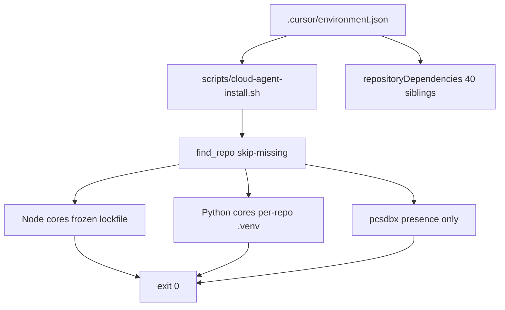

# SkinTwin-AI Org Ecosystem Cloud Agent Environment - Plan

## Goal Capsule

- **Objective:** Version the skintwin-ai org Cloud Agent environment in `skintwin-ecosystem-design` so a checkout of this hub plus siblings can bootstrap a CPU-friendly workspace without dashboard-only config.
- **Authority:** Product Contract owns behavior. Planning Contract owns mechanism. Implementation Units execute cited R/KTD IDs. Cursor environment schema at `https://cursor.com/schemas/environment.schema.json` owns field names and `unevaluatedProperties: false`.
- **Stop conditions:** Hub-only files ship. Sibling application bugs stay untouched. GPU/Julia/PHP stacks stay out of default install. Live secrets and long-running servers stay out of bootstrap.
- **Execution profile:** Code change in a docs hub. Prove config and script contracts with stdlib tests. Re-run the local install only as a characterization check, not as hub CI.
- **Tail ownership:** `ce-work` implements units in dependency order, then LFG review/ship.

---

## Product Contract

### Summary

Cloud Agents that start from a `skintwin-ecosystem-design` revision need a repo-managed environment for the skintwin-ai organization, not one app.
This hub is the canonical home for that org-wide agent infrastructure: sibling token scope, idempotent CPU-core install, and agent-facing notes.
A sibling used as the Cloud Agent primary repository does not load this file.
Dashboard Save remains a human action and does not replace committed files.

### Problem Frame

The org is 41 repositories with mixed Node, Python, Julia, PHP, and GPU stacks.
A greenfield env-setup produced a working install script and a dashboard draft, but no committed `.cursor/environment.json`.
Without a hub file, later agents cannot share the bootstrap, and a dashboard draft is not reviewable software.
A committed file replaces the dashboard environment document for that revision.
Omitted optional keys use schema and team-policy defaults, not leftover dashboard fields.
The file stays conservative: no snapshot IDs, secrets, or undeclared properties.

### Requirements

**Environment identity**

- R1. The hub ships a repo-managed Cloud Agent environment named for the skintwin-ai org.
- R2. The environment lists every sibling repository in this workspace as `repositoryDependencies`, excluding the hub itself.
- R3. `.cursor/environment.json` validates against the public Cursor schema and does not include `$schema` or other undeclared fields.

**Bootstrap**

- R4. `install` runs an idempotent hub script that installs a CPU-core subset when those repos are present.
- R5. Missing sibling checkouts are skipped with a log line and do not fail install.
- R6. Node installs honor the existing lockfile (pnpm frozen, yarn frozen, or `npm ci`) and do not rewrite lockfiles.
- R7. Python installs use a per-repo `.venv` and do not require GPU, Julia, or PHP toolchains.
- R8. Install does not start servers, run application test suites, or write live secrets.

**Orientation**

- R9. Hub docs tell an agent to start org-wide Cloud Agent work from this hub, where siblings resolve, which repos install by default versus checkout-only, and that tests and daemons are out of install.
- R10. Pre-existing sibling failures (org-skin aggregator import, skintwinnector TypeScript assets, skintwin-bot missing `dist/entry.js`) stay out of this change. Install success does not mean those apps are runnable.

### Actors

- A1. Cloud Agent starting from a `skintwin-ecosystem-design` revision.
- A2. Human operator who may also Save a dashboard environment.

### Key Flows

- F1. Fresh org checkout
  - **Trigger:** Agent pod starts with this hub revision and sibling checkouts in token scope.
  - **Actors:** A1
  - **Steps:** Cursor reads `.cursor/environment.json`. Install script locates present repos. CPU-core packages install. Script exits 0.
  - **Outcome:** Node and Python cores are usable. Absent repos are skipped.
  - **Covered by:** R1, R2, R4, R5, R6, R7
- F2. Partial checkout
  - **Trigger:** Only the hub plus a subset of siblings are present.
  - **Actors:** A1
  - **Steps:** `find_repo` misses absent names. Install logs `[skip]` and continues.
  - **Outcome:** Exit 0. No lockfile edits in missing trees.
  - **Covered by:** R5
- F3. Operator reads hub docs
  - **Trigger:** Agent or human opens README / AGENTS.md.
  - **Actors:** A1, A2
  - **Steps:** Docs name hub-as-entry, install vs later tests, checkout-only siblings, default-image base, and dashboard override rule.
  - **Outcome:** Operator does not add secrets or start daemons in install.
  - **Covered by:** R8, R9, R10
- F4. Present sibling, not CPU-core
  - **Trigger:** Agent opens a listed sibling that is not in the CPU-core install list.
  - **Actors:** A1
  - **Steps:** Install does not package-install that repo. Docs name it checkout-only or deferred GPU/Julia/PHP.
  - **Outcome:** Missing `node_modules` or `.venv` is expected, not a broken checkout.
  - **Covered by:** R4, R9

### Acceptance Examples

- AE1. Schema-legal environment file
  - **Covers:** R1, R2, R3
  - **Given:** `.cursor/environment.json` on disk
  - **When:** Parsed as JSON and checked against declared schema properties
  - **Then:** The JSON object keys are exactly `name`, `install`, and `repositoryDependencies`
- AE2. Skip missing repo
  - **Covers:** R5
  - **Given:** `CLOUD_AGENT_REPO_ROOTS` points at an empty temp directory
  - **When:** Install script runs
  - **Then:** stdout contains `[skip]` for each CPU-core name and the process exits 0 without network package installs
- AE5. Checkout-only sibling
  - **Covers:** R4, R9
  - **Given:** A `repositoryDependencies` entry outside the CPU-core list
  - **When:** Install script and AGENTS.md are inspected
  - **Then:** The script does not install that repo, and docs name checkout-versus-install
- AE3. Lockfile policy
  - **Covers:** R6
  - **Given:** A node repo with `pnpm-lock.yaml`
  - **When:** Install selects a package manager
  - **Then:** It uses `corepack pnpm install --frozen-lockfile` and does not add `pnpm-workspace.yaml` to `regima-platform`
- AE4. No daemon or secret bootstrap
  - **Covers:** R8
  - **Given:** The committed environment file and install script
  - **When:** Inspected for start/terminals and secret files
  - **Then:** No `start`/`terminals` keys, no Stripe/Mongo env files, no test-suite invocation in install

### Success Criteria

- Hub PR contains environment JSON, install script, tests, and orientation docs.
- Tests that encode AE1–AE5 pass with stdlib Python.
- Local re-run of the install script in this workspace is characterization only and is not a Definition of Done gate. If a present R10-named sibling fails install, do not patch that sibling.

### Scope Boundaries

**In scope**

- Files in `skintwin-ecosystem-design` only.
- CPU-core install list: Node and Python repos that env-setup already installed on the default image without GPU, Julia, or PHP toolchains (`skintwinnector`, `skinport`, `skintwin-customer-portal`, `cognitive-architecture`, `regima-platform`, `skintwin-bot`, `org-skin`, `skintwin-integrations`, `neuro-symbolic-core`, `pcsdbx` presence-only).
- Selection criterion: default-image, frozen lockfile or venv, no extra compilers. GPU/Julia/PHP and other siblings stay checkout-only until a later track.

**Deferred for later**

- GPU/Julia/PHP default install (`multiskin`, `Yggdrasil`, `llm-foundry`, PHP apps).
- `start`/`terminals` for live Mongo, Stripe, or app servers.
- Refresh of stale `analysis/repository_analysis.md` (still lists retired names such as `business-directory-template`).
- Fixing sibling compile/test bugs.

**Outside this product**

- Changing dashboard Save for the operator.
- Committing snapshot IDs (they are environment-local).
- Editing sibling application source.

### Dependencies

- Public schema: `https://cursor.com/schemas/environment.schema.json`.
- Proven install behavior in env-setup (local install exit 0; draft build `bld-20260917-7c7a79b2-fc94-42a7-b6b9-a1d48cdc75d3` succeeded).
- Sibling lockfiles already in those repos.

<!-- ce-section: work-relationships -->

This plan owns the hub Cloud Agent bootstrap.
Separately planned later: a GPU/Julia/PHP install track; a secret-backed `start`/`terminals` track; an analysis-inventory refresh.

---

## Planning Contract

### Key Technical Decisions

- KTD1. **Org-wide hub environment.** Commit the Cloud Agent environment in `skintwin-ecosystem-design`, with `repositoryDependencies` covering all workspace siblings except the hub. (session-settled: user-directed — chosen over a single-repository Cloud Agent env: the request named the skintwin-ai org ecosystem, not one app.) Governs R1, R2.
- KTD2. **Repo-managed file replaces dashboard document.** Ship `.cursor/environment.json` in git. Cursor uses the revision file instead of personal or team dashboard environments. Omitted keys (`mcpServerAllowlist`, `egressMode`, secrets) are unset in that document and follow schema/team defaults, not leftover dashboard fields. Dashboard Save may still exist; it must not be the only copy. Governs R1, R3.
- KTD3. **Default image plus install, no snapshot or Dockerfile in git.** Omit `snapshot`, `image`, and `build`. Snapshot IDs are not portable across environments. A custom Dockerfile is not needed for the CPU-core subset. Governs R3, R7.
- KTD4. **CPU-core install subset.** Install only the env-setup core list. Leave other siblings in `repositoryDependencies` for checkout/token scope, but do not install them in the default script. Governs R4, R7.
- KTD5. **Skip-missing, frozen lockfiles, no workspace-file edits.** Default `find_repo` layout is `/agent/repos/<name>`, `/workspace/repos/<name>`, `/workspace/<name>`, then package.json name match. Honor `CLOUD_AGENT_REPO_ROOTS` (colon-separated) when set so hermetic tests can point at an empty temp tree. Prefer existing lockfiles. Do not add `pnpm-workspace.yaml` to `regima-platform`. Governs R5, R6.
- KTD6. **Install never starts processes or tests.** Omit `start` and `terminals`. Do not run vitest, pytest, or `pnpm test`. The string `pytest` may appear as a pip package argument for `neuro-symbolic-core`. Governs R8.
- KTD7. **Hub stdlib tests, not a new package manager.** The hub has no Node/Python project today. Verify JSON and script contracts with `python3` unittest plus `bash -n`. Do not add pnpm/yarn to the hub for this change. Governs AE1–AE5.

### High-Level Technical Design

`install` in the JSON is `./scripts/cloud-agent-install.sh`.
The script is executable, `set -euo pipefail`, enables corepack, and installs `python3.12-venv` only when `ensurepip` is missing.

Node cores and lockfiles:

| Repo | Manager selection |
| --- | --- |
| `skinport` | pnpm lock |
| `skintwin-customer-portal` | pnpm lock |
| `regima-platform` | pnpm lock, no workspace file |
| `skintwin-bot` | pnpm lock preferred over also-present npm lock |
| `skintwinnector` | yarn lock |
| `cognitive-architecture` | `npm ci` via package-lock |

Python cores:

| Repo | Install args |
| --- | --- |
| `org-skin` | `-e ".[dev]"` |
| `skintwin-integrations` | `-r requirements.txt` |
| `neuro-symbolic-core` | `-e ./packages/nettica -e ./packages/neuro-symbolic-hybrid pytest` |

### Assumptions

- The workspace Cloud Agent `repos` list has 41 `github.com/skintwin-ai/*` URLs including the hub. Encode the 40 non-hub names from the Appendix as `repositoryDependencies`.
- Org membership changes after this snapshot need a later hub edit; this plan does not auto-discover GitHub org members.
- Hub-only PR is enough for LFG; sibling repos stay unmodified.
- Operator Save of the dashboard draft is independent of this PR.
- `python3` and `bash` exist on the default Cloud Agent image.

### Implementation Constraints

- Schema `unevaluatedProperties: false` — no `$schema`, no comments if the consumer is strict JSON (the schema allows comments; prefer standard JSON).
- Paths in the plan and docs are repo-relative.
- Do not copy `/tmp/skintwin-ecosystem-install.sh` blindly if it diverges; match its proven policy and keep the script in `scripts/`.
- Do not put real tokens, phone numbers, or live connection strings in examples.

### Sequencing

1. U1 install script (behavior source).
2. U2 environment JSON (depends on script path and sibling list).
3. U3 tests (depends on U1+U2 contracts).
4. U4 orientation docs (depends on U1+U2 facts).

---

## Implementation Units

### U1. Cloud Agent install script

- **Goal:** Persist the proven CPU-core bootstrap as an idempotent hub script.
- **Requirements:** R4, R5, R6, R7, R8
- **KTDs:** KTD4, KTD5, KTD6
- **Files:**
  - Create `scripts/cloud-agent-install.sh`
- **Approach:** Port the env-setup script policy: skip-missing `find_repo` with `CLOUD_AGENT_REPO_ROOTS` override, frozen Node installs, per-repo venvs, pcsdbx presence-only, no test-runner invocation, no servers. Keep helper functions; do not expand the install list. Do not add hub-script workarounds for R10 sibling defects. Make the file executable.
- **Patterns:** env-setup install script; Cursor env-setup skill install vs start vs terminals table.
- **Test scenarios:**
  - T1. `bash -n` succeeds.
  - T2. With `CLOUD_AGENT_REPO_ROOTS` pointing at an empty temp dir, every CPU-core name logs `[skip]` and the process exits 0 with no package-manager network.
  - T3. Script source contains frozen pnpm/yarn/`npm ci` and does not invoke test runners (`pytest` as a command, `vitest`, `pnpm test`, `npm test`). The pip package argument `pytest` on neuro-symbolic-core is allowed.
  - T4. Script source does not contain `pnpm-workspace.yaml` writes.
  - T5. GPU/Julia names such as `multiskin`, `Yggdrasil`, `llm-foundry` are not install targets.
  - T13. Script source does not source `.env` files or write credential paths.
- **Verification:** U3 tests plus `bash -n scripts/cloud-agent-install.sh`.
- **Dependencies:** none

### U2. Repo-managed environment.json

- **Goal:** Make the hub revision the Cloud Agent config source.
- **Requirements:** R1, R2, R3, R8
- **KTDs:** KTD1, KTD2, KTD3, KTD6
- **Files:**
  - Create `.cursor/environment.json`
- **Approach:** Set `name` to a human-readable org label (for example `skintwin-ai org ecosystem`). Set `install` to `./scripts/cloud-agent-install.sh`. Set `repositoryDependencies` to the 40 Appendix URLs. Omit `start`, `terminals`, `ports`, `snapshot`, `image`, `build`, `user`, and `$schema`. Top-level keys must be exactly `name`, `install`, and `repositoryDependencies`.
- **Patterns:** Cursor schema `definitions.common` + `definitions.container`; env-setup "Common environment.json Fields".
- **Test scenarios:**
  - T6. JSON parses.
  - T7. `set(keys) == {"name", "install", "repositoryDependencies"}`.
  - T8. `repositoryDependencies` matches the Appendix list, unique, `github.com/skintwin-ai/` prefixed.
  - T9. Hub URL is not in the list.
  - T10. `install` equals `./scripts/cloud-agent-install.sh`.
- **Verification:** U3 tests.
- **Dependencies:** U1 (script path)

### U3. Contract tests

- **Goal:** Lock schema, skip-missing, and install-policy behavior without adding a hub package manager.
- **Requirements:** R3, R5, R6, R8
- **KTDs:** KTD7
- **Files:**
  - Create `tests/test_cloud_agent_env.py`
  - Create `tests/fixtures/` only if a temp-dir skip-missing harness needs a stub (prefer tmp in test code).
- **Approach:** Stdlib `unittest`. Parse `.cursor/environment.json`. Assert AE1 exact key set. Assert Appendix sibling list. Read the install script as text for lockfile policy, T3/T13, and non-install names. For AE2, run the real script with `CLOUD_AGENT_REPO_ROOTS` set to an empty temp directory so every CPU-core name is skipped. Do not invoke package managers during `python3 -m unittest`.
- **Patterns:** pcsdbx-style stdlib tests; keep the hub dependency-free.
- **Test scenarios:** T1–T13 and T11–T12 from U1/U2/U4, implemented here.
- **Verification:** `python3 -m unittest tests/test_cloud_agent_env.py`
- **Dependencies:** U1, U2

### U4. Agent orientation docs

- **Goal:** Tell future agents how this hub environment works.
- **Requirements:** R9, R10
- **KTDs:** KTD2, KTD4, KTD6
- **Files:**
  - Create `AGENTS.md`
  - Update `README.md`
- **Approach:** Short AGENTS.md: this hub is the Cloud Agent entry for org-wide work; sibling path conventions; CPU-core install list versus checkout-only siblings; do-not-start-servers; do-not-fix-unrelated-sibling-bugs; do not commit `.venv` or credential files in siblings; dashboard-file precedence; skintwin-bot install does not imply a runnable `dist/entry.js`. README adds a Cloud Agent Environment section with a link to the script. Do not rewrite architecture chapters or refresh stale analysis in this unit.
- **Patterns:** Existing README tone; keep placeholders generic.
- **Test scenarios:**
  - T11. `AGENTS.md` and `README.md` mention skip-missing, CPU-core versus checkout-only, hub-as-entry, and that `install` does not run app tests.
  - T12. Docs do not instruct committing snapshot IDs, `.venv`, or live secrets.
- **Verification:** Grep/assertions in U3 or a small docstring check in `tests/test_cloud_agent_env.py`.
- **Dependencies:** U1, U2

---

## Verification Contract

| Gate | Command | Applies to | Pass signal |
| --- | --- | --- | --- |
| Unit tests | `python3 -m unittest tests/test_cloud_agent_env.py` | U1–U4 | All tests OK |
| Script syntax | `bash -n scripts/cloud-agent-install.sh` | U1 | Exit 0 |
| JSON parse | `python3 -c 'import json,pathlib; json.loads(pathlib.Path(".cursor/environment.json").read_text())'` | U2 | Exit 0 |

Characterization in this workspace (`./scripts/cloud-agent-install.sh`) is optional evidence. It is not a Definition of Done gate. If it fails on an R10-named sibling, do not patch that sibling.

Do not add hub GitHub Actions in this plan.
Do not treat sibling pytest/vitest as gates for this PR.
`release:validate` does not apply; the hub has no release pipeline.

**Deliberate test exception:** Full sibling package installs are characterization in this multi-repo workspace, not hermetic unit tests. Unit tests must not require network package downloads.

---

## Definition of Done

**Global**

- U1–U4 complete against cited requirements.
- Verification Contract unit gates pass.
- No sibling application source in the diff.
- Abandoned experiments (extra Dockerfiles, snapshot IDs, workspace-file edits) are absent from the tree.
- Plan file may ship in the same PR as the feature; it is not a substitute for the environment files.

**Per unit**

- U1. Script exists, is executable, matches CPU-core policy, skip-missing, frozen lockfiles.
- U2. Environment JSON is schema-legal and lists 40 siblings.
- U3. `python3 -m unittest tests/test_cloud_agent_env.py` passes.
- U4. AGENTS.md and README describe hub-as-entry, CPU-core versus checkout-only, and bootstrap vs later tests.

---

## System-Wide Impact

This change is the org Cloud Agent bootstrap, not an application runtime.

- **Config precedence.** A committed `.cursor/environment.json` replaces personal and team dashboard environment documents for that git revision. After merge, agents started from the hub revision use the file. Omitted keys are not copied from the dashboard draft; they follow schema and inherited team/user MCP or network policy as the schema defines.
- **Token and checkout scope.** `repositoryDependencies` lists all 40 siblings so the generated GitHub token can clone them, including GPU/Julia/PHP repos that install does not bootstrap. Dashboard cannot narrow that token after merge. AGENTS.md must tell agents not to bulk-read sibling trees outside the current task.
- **Workspace layout.** Sibling resolution is path-based (`CLOUD_AGENT_REPO_ROOTS` or `/agent/repos`, `/workspace/repos`, `/workspace/<name>`). Agents must not assume a single `/workspace` tree is the only layout.
- **Install vs later boots.** If an environment build snapshots after install, later pods may not re-run `install`. The script must stay idempotent for the cases that do re-run it. Process state still does not survive a snapshot, which is why `start`/`terminals` stay omitted. Lockfile changes after a snapshot need a new environment build, not a hub unit-test change.
- **Failure propagation.** A non-zero `install` fails environment start. Skip-missing and frozen lockfiles exist so an absent sibling does not take down the hub environment. Known sibling test/type errors are not install failures and must not be "fixed" in this PR.
- **MCP, egress, secrets.** This plan does not set `mcpServerAllowlist`, `egressMode`, or secret files. Live Stripe/Mongo credentials remain operator-supplied later, never in hub git.
- **Sibling repos.** No application code, lockfiles, or CI in the 40 siblings change. Hub-only blast radius. Do not commit `.venv` directories created in siblings.

---

## Risks

- **Committed JSON replaces dashboard.** After merge, agents on this revision ignore the dashboard draft. Mitigation: keep keys exact (KTD2) and omit non-portable snapshot IDs (KTD3).
- **Token blast radius.** Forty-repo GitHub token scope is wider than the ten-repo install list. Mitigation: document in AGENTS.md; do not shrink `repositoryDependencies` (KTD1).
- **Partial checkouts.** Cloud Agents may not materialize every sibling even when listed. Mitigation: skip-missing (KTD5).
- **regima-platform frozen lockfile.** Adding a workspace file previously failed install. Mitigation: do not touch that repo (R10, KTD5).
- **skintwin-bot dual lockfiles.** Both pnpm and npm locks exist. Mitigation: prefer pnpm lock as in the proven script. Install success does not imply a runnable `dist/entry.js`.
- **ensurepip missing on some images.** Mitigation: apt-install `python3.12-venv` only when needed, as already proven.

## Sources

- Cursor environment schema: `https://cursor.com/schemas/environment.schema.json`
- Cursor Cloud Agent setup: `https://cursor.com/docs/cloud-agent/setup`
- Env-setup skill field and install/start/terminals rules (local skill `env-setup`)
- Current workspace repo list from Cloud Agent environment-info (41 URLs including hub; 40 siblings for `repositoryDependencies`)
- Proven install policy from env-setup local runs (exit 0; no lockfile rewrites)

---

## Appendix

Authoritative `repositoryDependencies` (40), hub excluded:

`github.com/skintwin-ai/SolutionSpaceKernel`, `github.com/skintwin-ai/Yggdrasil`, `github.com/skintwin-ai/anycog`, `github.com/skintwin-ai/cognitive-architecture`, `github.com/skintwin-ai/ecosystem-bridge`, `github.com/skintwin-ai/esm`, `github.com/skintwin-ai/gnu_gneuralnetwork`, `github.com/skintwin-ai/llm-foundry`, `github.com/skintwin-ai/mini-swe-agent`, `github.com/skintwin-ai/multiskin`, `github.com/skintwin-ai/neuro-symbolic-core`, `github.com/skintwin-ai/ojskin`, `github.com/skintwin-ai/openapi-skintwin`, `github.com/skintwin-ai/org-analysis`, `github.com/skintwin-ai/org-skin`, `github.com/skintwin-ai/pcsdbx`, `github.com/skintwin-ai/regima-persistence-docs`, `github.com/skintwin-ai/regima-platform`, `github.com/skintwin-ai/regima-train-nnllms`, `github.com/skintwin-ai/regima-training-lms`, `github.com/skintwin-ai/regima-website`, `github.com/skintwin-ai/regular-polytope-networks`, `github.com/skintwin-ai/skin-multiscale-model`, `github.com/skintwin-ai/skin-zone`, `github.com/skintwin-ai/skin7nn`, `github.com/skintwin-ai/skincare-directory`, `github.com/skintwin-ai/skincare-salon-app`, `github.com/skintwin-ai/skinform`, `github.com/skintwin-ai/skinport`, `github.com/skintwin-ai/skinsource-pro`, `github.com/skintwin-ai/skinsuitesdk`, `github.com/skintwin-ai/skintwin`, `github.com/skintwin-ai/skintwin-asi`, `github.com/skintwin-ai/skintwin-backend-paphos`, `github.com/skintwin-ai/skintwin-bot`, `github.com/skintwin-ai/skintwin-customer-portal`, `github.com/skintwin-ai/skintwin-integrations`, `github.com/skintwin-ai/skintwin-salon`, `github.com/skintwin-ai/skintwind`, `github.com/skintwin-ai/skintwinnector`
